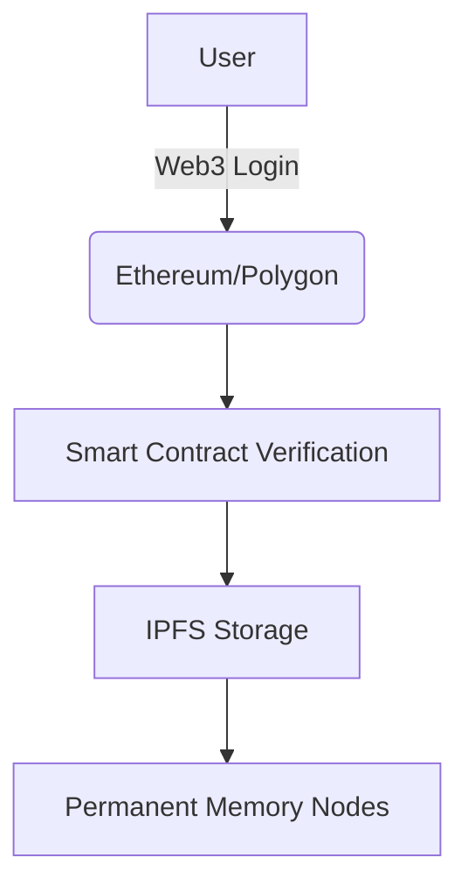

# 🌌 Parallel World - A Digital Memorial

## ✨ Project Vision

"Parallel World" is an open-source project that uses technology to commemorate the departed. We believe:

> "People are only truly gone when forgotten."

This is a digital memorial space for loved ones, friends, and pets who have left us but still live in our memories.

## 🌟 Project Goals

- Use blockchain technology to ensure memorial data **cannot be tampered with**
- Guarantee **permanent preservation** through decentralized storage
- Create **digital monuments** that transcend time and space
- Establish **emotional connections** between the living and the departed
- Keep the project free and open-source **without profit motives**

## 🔗 Web3 Architecture

### Core Technologies:

- **Blockchain Login**: Decentralized authentication via MetaMask wallets
- **IPFS Storage**: All memorial data stored on the InterPlanetary File System
- **Smart Contracts**: Manage data ownership and access permissions

## 🛠️ How to Use

1. Install MetaMask browser extension
2. Connect your digital wallet
3. Create or access memorial spaces
4. Upload text, images and other memorial content
5. Pay minimal Gas fees for on-chain verification

## 💖 Contribution Guide

We welcome all forms of contributions:

- Frontend development
- Smart contract optimization
- Documentation translation
- Design improvements

Please see [CONTRIBUTING.md]() for details.

## 🚀 Project Status

Currently in feature planning stage. Proposed tech stack includes:

- Frontend: React/Next.js
- Smart Contracts: Solidity
- Backend: Java
- AI Development

Requirements document: [Tencent Docs]Parallel World Development
https://docs.qq.com/sheet/DRFZ6UUhqSGtIcXFn?tab=BB08J2

Developers with ideas are welcome to join and help refine requirements!

## 📜 License

Apache 2.0 Open Source License - See [LICENSE](LICENSE)

## 🌈 Special Thanks

To all the guardians who keep memories alive.

> "Death is not the end, forgetting is."

---

⭐ If moved by this project, please give us a star!

🔗 Official Site: [parallelworld.space](https://parallelworld.space)