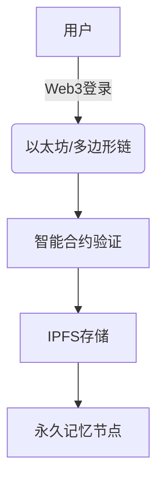

# 🌌 Parallel World - 平行世界

<!--  *（建议替换为实际项目相关图片）* -->

## ✨ 项目初心

"平行世界"是一个用技术铭记逝者的开源项目。我们相信：

> "只有在真正被人们所遗忘的时候，才算真正的逝去。"

这里是为那些离开了我们，却依然活在记忆中的亲人、朋友和宠物们建立的数字纪念馆。

## 🌟 项目愿景

- 利用区块链技术确保纪念数据**不可篡改**
- 通过去中心化存储保证记忆**永久保存**
- 创造跨越时空的**数字纪念碑**
- 建立连接生者与逝者的**情感纽带**
- 我们确保项目免费开源**不以盈利为目标**

## 🔗 Web3技术架构

### 核心技术：

- **区块链登录**：通过MetaMask等钱包实现去中心化身份认证
- **IPFS存储**：所有纪念数据分布式存储在星际文件系统
- **智能合约**：确保数据所有权和访问权限管理

## 🛠️ 如何使用

1. 安装MetaMask浏览器插件
2. 连接你的数字钱包
3. 创建或访问纪念空间
4. 上传文字、图片等纪念内容
5. 支付少量Gas费完成链上存证

## 💖 贡献指南

我们欢迎所有形式的贡献：

- 前端开发
- 智能合约优化
- 文档翻译
- 设计改进

请查看[CONTRIBUTING.md]()了解详情。

## 🚀 项目进度

当前处于具体功能的设想阶段，规划中的技术栈包括：

- 前端开发：React/Next.js
- 智能合约：Solidity
- 后端开发：Java
- AI开发

需求文档地址：[腾讯文档]平行世界需求开发
https://docs.qq.com/sheet/DRFZ6UUhqSGtIcXFn?tab=BB08J2

欢迎有想法的开发者申请加入，一起完善功能需求！

## 📜 许可证

Apache 2.0 开源协议 - 详见[LICENSE](LICENSE)

## 🌈 特别致谢

感谢所有让这个世界不被遗忘的守护者们。

> "死亡不是终点，遗忘才是。"

---

⭐ 如果你被这个项目感动，请给我们一个star！

🔗 官方链接：[parallelworld.space](https://parallelworld.space) 
